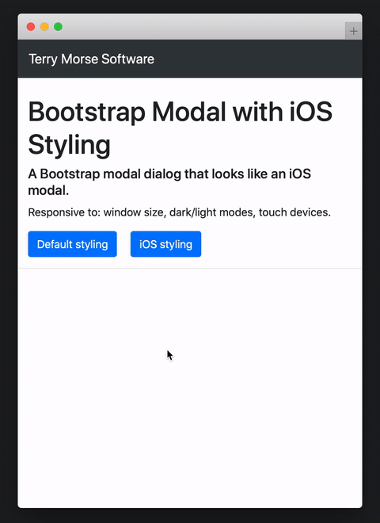
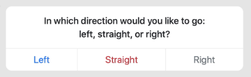
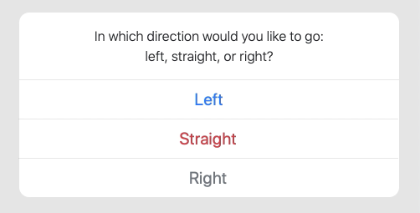

# bootstrap-ios-modal

A Bootstrap modal styled to look like an iOS modal
---


**bootstrap-ios-modal** is a responsive Bootstrap modal that looks and
 acts like an iOS dialog.

On extra small screens, the modal mimics an iPhone:
* vertically stacks buttons
* scrolls up from the bottom of the screen

On larger screens, the modal mimics an iPad:
* horizontally stacks buttons
* fades in to the center of the screen

On all screens, the modal responds to light/dark mode preference.

## Usage
```html
<html>
<head>
  <link rel="stylesheet"
   href="https://cdn.jsdelivr.net/gh/terrymorse58/bootstrap-ios-modal@latest/iosmodal.css">
</head>
<body>
  <script
    src="https://cdn.jsdelivr.net/gh/terrymorse58/bootstrap-ios-modal@latest/iosmodal.js">
  </script>
</body>
</html>
```
## Example

Large screen:



Extra small screen:



JavaScript:
```js
const bodyContent = "In which direction would you like to go<br/>" +
                    "left, straight, or right?";
const buttons = [
    {
        class: "btn btn-lg btn-outline-primary",
        innerHTML: "Left",
        onclick: () => { doSomething('left'); }
    }, {
        class: "btn btn-lg btn-outline-danger",
        innerHTML: "Straight",
        onclick: () => { doSomething('straight'); }
    }, {
        class: "btn btn-lg btn-outline-secondary",
        innerHTML: "Right",
        onclick: () => { doSomething('right'); }
    }
];
iOSModal.show(bodyContent, buttons);
```
---
## Functions

## `show()` ##
Display a modal dialog.
#### Syntax ####
````
iOSModal.show(bodyContent, buttons)
````
#### Parameters ####
`bodyContent`<br>
&nbsp;&nbsp;&nbsp; {String | Node} Content displayed in the body portion of the modal.<br>
&nbsp;&nbsp;&nbsp; May be a string of HTML, or a single DOM Node.

`buttons`<br>
&nbsp;&nbsp;&nbsp; {Array} - Array of objects defining buttons to display.

Individual `button` properties:<br>

&nbsp;&nbsp;&nbsp; `class` - Button's class property.<br>
&nbsp;&nbsp;&nbsp; `innerHTML` - Button's displayed text or HTML.<br>
&nbsp;&nbsp;&nbsp; `onclick` - Function to call upon button click.<br>

Any other properties, such as `id`, `name`, etc., will be assigned as-is to the button.

#### Return value ####
None.

---
## `hide()` ##
Hide the modal.
#### Syntax ####
````
iOSModal.hide()
````
#### Return value ####
None.

---
## `customize()` ##
Customize the modal's behavior.
#### Syntax ####
````
iOSModal.customize(options)
````
#### Parameters ####
`options`<br>
&nbsp;&nbsp;&nbsp; {Object} - Specifies options for modal behavior.

Properties of `options`:

&nbsp;&nbsp;&nbsp; `bottom` - {String} Modal's distance from bottom of screen.<br>
&nbsp;&nbsp;&nbsp;&nbsp;&nbsp; Only affects "scroll-from-bottom" modal.<br>
&nbsp;&nbsp;&nbsp;&nbsp;&nbsp; Default value is "50px" (matches iPhone).
#### Return value ####
None.


